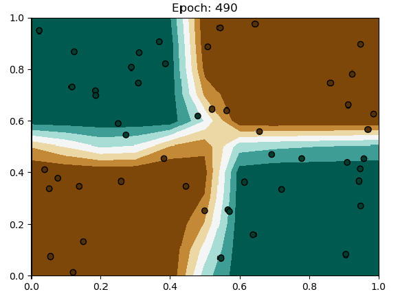

# MiniTorch Module 1  


* Docs: https://minitorch.github.io/

* Overview: https://minitorch.github.io/module1.html

This module requires `operators.py` and `module.py` from Module 0

```
cp ../Module-0/operators.py ../Module-0/module.py minitorch/
```


* Tests:

```
python run_tests.py
```


```


Epoch  0  loss  33.827013303316406 correct 30
Epoch  10  loss  32.84253095185056 correct 30
Epoch  20  loss  31.071647776975524 correct 33
Epoch  30  loss  27.299019461166836 correct 44
Epoch  40  loss  21.120097787343344 correct 47
Epoch  50  loss  15.291804728677462 correct 48
Epoch  60  loss  11.079394347459196 correct 50
Epoch  70  loss  8.603220383432111 correct 50
Epoch  80  loss  8.143850084911985 correct 48
Epoch  90  loss  12.261238431928932 correct 43
Epoch  100  loss  8.41147943452198 correct 46
Epoch  110  loss  5.710749260019077 correct 49
Epoch  120  loss  4.84737394087706 correct 49
Epoch  130  loss  3.7916331146681355 correct 50
Epoch  140  loss  2.992457838235576 correct 50
Epoch  150  loss  2.6552429498185117 correct 50
Epoch  160  loss  2.3800274925409517 correct 50
Epoch  170  loss  2.1800548473746955 correct 50
Epoch  180  loss  2.0300372209096507 correct 50
Epoch  190  loss  1.8569688798287685 correct 50
Epoch  200  loss  1.7093400827433618 correct 50
Epoch  210  loss  1.5813454653744392 correct 50
Epoch  220  loss  1.4810687145210406 correct 50
Epoch  230  loss  1.394595383629208 correct 50
Epoch  240  loss  1.317410074461596 correct 50
Epoch  250  loss  1.2473360218625993 correct 50
Epoch  260  loss  1.1834605194320258 correct 50
Epoch  270  loss  1.125023141177695 correct 50
Epoch  280  loss  1.0713841079492537 correct 50
Epoch  290  loss  1.0220005699391839 correct 50
Epoch  300  loss  0.9764084678894003 correct 50
Epoch  310  loss  0.9342084470265384 correct 50
Epoch  320  loss  0.8950547745084043 correct 50
Epoch  330  loss  0.8586465185308051 correct 50
Epoch  340  loss  0.8247204542085901 correct 50
Epoch  350  loss  0.7930453043268916 correct 50
Epoch  360  loss  0.7634170237223004 correct 50
Epoch  370  loss  0.7356549080584027 correct 50
Epoch  380  loss  0.7095983600021045 correct 50
Epoch  390  loss  0.6853879725296456 correct 50
Epoch  400  loss  0.662685497002138 correct 50
Epoch  410  loss  0.641368597281683 correct 50
Epoch  420  loss  0.6209825189866022 correct 50
Epoch  430  loss  0.6020496210200272 correct 50
Epoch  440  loss  0.5841983861574779 correct 50
Epoch  450  loss  0.5673002979484504 correct 50
Epoch  460  loss  0.5512565302955936 correct 50
Epoch  470  loss  0.5359944894079984 correct 50
Epoch  480  loss  0.5214556118246244 correct 50
Epoch  490  loss  0.507589835401413 correct 50

Process finished with exit code 0
```



```
Setting up a new session...
Epoch  0  loss  41.3044475408928 correct 32
Epoch  10  loss  28.19325864108287 correct 32
Epoch  20  loss  25.496845326120678 correct 36
Epoch  30  loss  23.223157747050482 correct 38
Epoch  40  loss  20.6293719328228 correct 43
Epoch  50  loss  17.457875377284243 correct 47
Epoch  60  loss  14.674894540503034 correct 48
Epoch  70  loss  21.067770258016637 correct 36
Epoch  80  loss  11.18685851718468 correct 48
Epoch  90  loss  10.519528177595507 correct 48
Epoch  100  loss  9.759244262561088 correct 48
Epoch  110  loss  7.689686973125776 correct 48
Epoch  120  loss  7.603424291757357 correct 49
Epoch  130  loss  8.30156537324401 correct 46
Epoch  140  loss  7.976541338468319 correct 46
Epoch  150  loss  6.6896297683430594 correct 48
Epoch  160  loss  6.182284860908452 correct 48
Epoch  170  loss  6.100301488587491 correct 47
Epoch  180  loss  5.890894569058776 correct 47
Epoch  190  loss  5.440738653641937 correct 47
Epoch  200  loss  4.7796264676545 correct 48
Epoch  210  loss  4.4057110847622925 correct 48
Epoch  220  loss  4.535102515556293 correct 48
Epoch  230  loss  4.821059628242067 correct 47
Epoch  240  loss  5.483257608017951 correct 47
Epoch  250  loss  4.662352852524266 correct 47
Epoch  260  loss  3.5651110167510387 correct 48
Epoch  270  loss  3.20788242248477 correct 49
Epoch  280  loss  3.262027012277489 correct 48
Epoch  290  loss  3.4755593839189087 correct 48
Epoch  300  loss  3.865992326917327 correct 48
Epoch  310  loss  4.203547630020823 correct 47
Epoch  320  loss  3.803132890413559 correct 48
Epoch  330  loss  3.2722210306173096 correct 48
Epoch  340  loss  3.1034183693354356 correct 48
Epoch  350  loss  3.032535262690371 correct 49
Epoch  360  loss  3.1352453240716605 correct 49
Epoch  370  loss  3.1424342947861246 correct 49
Epoch  380  loss  3.1026491731307693 correct 49
Epoch  390  loss  2.9359078780169434 correct 49
Epoch  400  loss  2.8970515279018376 correct 49
Epoch  410  loss  2.7817488485265383 correct 49
Epoch  420  loss  2.8099484740494187 correct 49
Epoch  430  loss  2.330966101079426 correct 49
Epoch  440  loss  1.9337120187937056 correct 50
Epoch  450  loss  2.4719181918414614 correct 49
Epoch  460  loss  3.3788412931342364 correct 48
Epoch  470  loss  3.232314042540007 correct 49
Epoch  480  loss  2.630199185610404 correct 49
Epoch  490  loss  1.747232116180363 correct 50

Process finished with exit code 0
```


